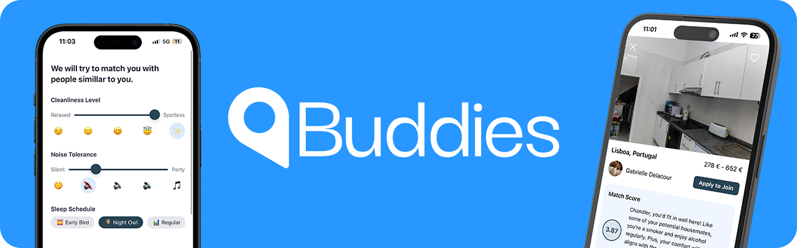

<p align="center">
  <b>🏅 4th place project</b> of the <a href="https://shiftappens.com">Shift APPens Hackathon</a>, 11th edition
</p>

# Buddies 🏠

> A platform that reimagines co-living for students and young professionals.

**Buddies** is a platform that reimagines co-living by connecting people and homeowners with like-minded individuals who share similar interests and lifestyles. It helps foster a more welcoming, enjoyable, and harmonious living environment by emphasizing compatibility and community from the start.

Beyond matching housemates, **Buddies** functions as a centralized house management app—offering tools to organize chores, split bills, and streamline communication. 

By combining social compatibility with smart house management, **Buddies** reduces friction, improves tenant satisfaction, and creates homes where people actually want to live.

## Setup and running 🚀

> [!IMPORTANT]
> **Note**: This repository contains only the frontend. You'll also need to run the [Buddies backend](https://github.com/HouseBuddies/buddies_backend).

Firstly, install all required dependencies.

```bash
npm install
```

Create a `.env.local` file in the project root with the following:
```
API_URL=<your-backend-api-url>
GOOGLE_API_KEY=<google-maps-project-api-key>
```

And finally, start the application.

```bash
npx expo start
```

## Team 💪

Built with passion at Shift APPens by a team of four dedicated shifters:

- [Afonso Santos](https://github.com/afonso-santos)
- [João Lobo](https://github.com/joaodiaslobo)
- [Júlio Pinto](https://github.com/juliojpinto)
- [Mário Rodrigues](https://github.com/mariorodrigues10)
